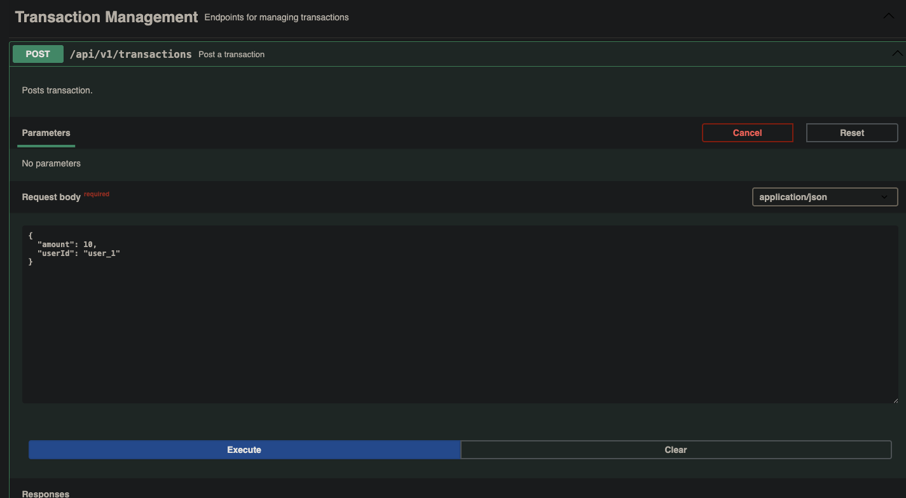
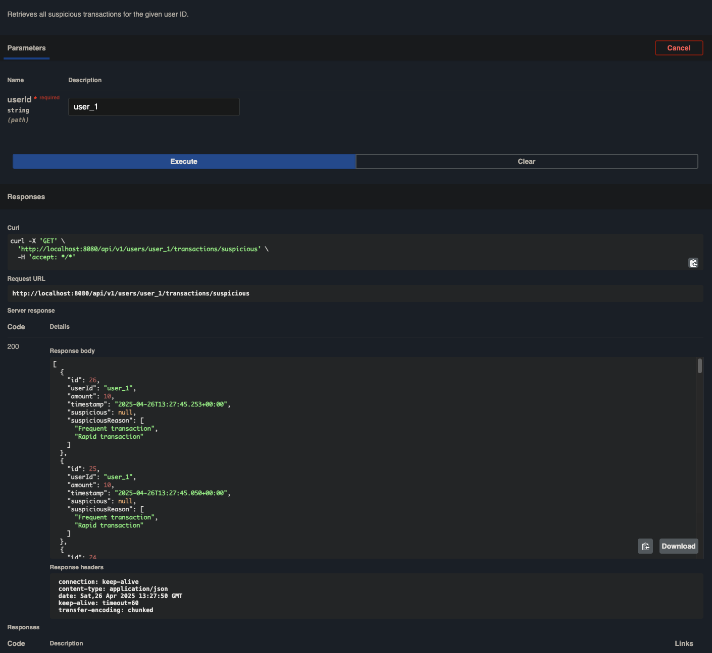

# Remo Transaction Scanner

Transaction Scanner is a Spring Boot application that records transactions and detects suspicious activity
using predefined rules based on transaction frequency, volume, and rapid transaction occurrences.

# Prerequisites
For running the service, ensure you have `Docker` installed locally


# Getting Started
Follow these steps to get the service up and running:

1. Clone the repository.
2. Open a terminal and navigate to the project directory.
3. Run the following command to start the service:

```bash
docker compose up
```


## Local development
Ensure Java 21 installed

Use Gradle wrapper (./gradlew) for build and testing

Run the application:

```bash
./gradlew bootRun
````

Run tests:
```bash
./gradlew test
````

Format code:
```bash
./gradlew spotlessApply
```

# API Documentation
The endpoints are auto documented with Swagger and can be found at

`http://localhost:8080/swagger-ui/index.html`


## api/v1/transactions

### POST transaction
**Endpoint**: `POST` `/api/v1/transactions`

***Overview***: Sends a transaction with `user_id` and `amount` to the backend

It should be noted that `Timestamps` are not submitted in the request. For security, timestamps are always generated serverside.




### GET suspicious transaction
**Endpoint**: `GET` 	`/api/v1/users/{userId}/transactions/suspicious`

***Overview***: Gets list of suspicious transaction with the `suspiciousReason` for a given userId. A transaction can have multiple `suspiciousReasons` if it meets
multiple suspicious criteria.



## Technologies Used
- **Java 21**
- **Spring Boot**: Framework for building the service. Reduces boilerplate code for quicker development.
- **Postgres**: Supports high performance views to query suspicious transactions.
- **JUnit 5, Mockito, TestContainers**: For unit and integration testing.
- **Flyway**: DB schema management.
- **Docker**: Allows containerisation of application.

# Project overview and structure

A `transaction` is posted through the `/api/v1/transactions` endpoint.

The `TransactionScannerService` saves the transaction to the DB.

Users query suspicious transactions with `/api/v1/users/{userId}/transactions/suspicious`

Suspicious transactions are detected based on:
- Frequent Transactions (via the `suspicious_frequent_transactions` view).
  - The level of frequency can be tuned in the `suspicious_transaction_configuration` table
- High Volume Transactions (via the `suspicious_high_volume_transactions` view)
- Rapid Transactions (via the `suspicious_rapid_transactions` view)

## Components

- `TransactionScannerApplication`
  - Entry point of the Spring Boot application.
- `TransactionController`
  - REST Controller exposing endpoints to post transactions and fetch suspicious transactions.
- `RestExceptionHandler`
  - Global exception handler for validation and request errors.
- `TransactionScannerService`
  - Core service handling business logic for saving transactions and retrieving suspicious transactions.
- `SuspiciousTransactionFinder`
  - Service responsible for querying suspicious transaction patterns from DB views.
- `ressources/db/migration`: `Flyway` migration script with view logic.
- `test`: test directory including integration tests.


# Approach
The application is able to identify saved transactions as suspicious by running 3 separate Postgres Views and
combining the result to get all suspicious transactions per user.

## Main tradeoff
This system favors strong consistency for suspicious transaction detection at the cost of read query latency.
Since each GET suspicious transaction request requires Postgres to re-run a view, performance could take a hit
if read volume surpass Postgres's read capacity. However, the speed trade off comes with the benefits of consistent results (always correct suspicious transactions).


This approach was chosen for the following reasons:
- **Strongly consistent results**: views allow us to have an up to date (consistent) view of all the suspicious transactions, going with the assumption of the financial context, consistent would be favoured over speed. This allows us to always avoid stale suspicious results.
- **Simplicity**: Views simplify the suspicious look-up logic by offloading it to Postgres. Postgres is also more efficient
  at performing aggregation functions than pulling the rows into Java and sorting them (since Postgres is purpose built for these operations)
  - Materialised views could have been an option too to improve read performance, however this would introduce eventual consistency.
  - E.g.: if writes > reads, we would need to
    `Refresh` the view each time to produce consistent results. If we find that reads > writes, we could consider using materialised views instead
- **Staleness management**: Due to the tunable `N transactions below $100` feature, precomputing the suspicious transactions is difficult. If `N` changes, all the precomputed
  N transactions would be invalid. Using views vastly simplifies this staleness / state management consideration


# Design considerations

## Dependency Injection
The application used the dependency injection design principle to allow for ease of testing and extensibility.
DI is handled using Spring Boot's dependency injection framework.

## SOLID
The code follows SOLID principles. Classes have a singular responsibility and can be extended in functionality (using DI).

## Testing views
Integration testing using the exact views and schemas used was done to ensure the correct operation of
suspicious transaction finding.

## Schema management
A schema management library was chosen instead of managing the schemas in an ORM as offloading the suspicious lookup logic to
Postgres improve performance, and using a schema management library allows us to version and maintain our views.

## Security
Timestamps are generated server side to prevent spoofing.

## Request validation and error handling
Request params are validated using Spring Boot's `@Valid`. A global error handler class is implemented to give API consumers
relevant error messages.


## DB Schema
### Tables
- `transaction_scanner.transaction`
  - Stores all transactions.
- `transaction_scanner.suspicious_transaction_configuration`
  - Stores config for determining `N transactions below $100 within an hour`.
    `
### Views
- `transaction_scanner.suspicious_frequent_transactions`
  - Returns `N transactions below $100 within an hour` by user based on the `n` value from `transaction_scanner.suspicious_transaction_configuration`.
- `transaction_scanner.suspicious_high_volume_transactions`
  - Returns transactions with `amount` >= `10,000`.
- `transaction_scanner.suspicious_rapid_transactions`
  - Groups transactions by user_id and the count of transaction in a 5 min window. Returns rows where the grouped count >= 3.

# Testing

Running the tests can be done using Gradle:

## Mac
```bash
`./gradlew test`
```

## Windows
```bash
gradlew.bat test
```


## Unit testing
Unit testing was done to ensure basic and expected functionality of all components.

### Integration testing
Integration testing was done using `TestContainers` and `TestRestMvc` to ensure that the service was tested to as close to production
environment as possible. This also allows us to test the view logic.

Integration testing also ensures correct Spring Boot DI wiring.

# Known Limitations
- Querying suspicious transactions is synchronous and can lead to database pressure under heavy read load.
- Lack of authentication and authorization (assumes trusted clients).
- No API rate-limiting implemented yet.
- No observability stack (metrics, tracing) included.

# Future improvements

## Observability
For a production ready application, we'd introduce logging and metrics collection.


## Scaling consideration
If this application is needed to scale to serve higher volumes this approach could be taken in order of least to most traffic:
1. Vertical scaling: add more capacity to current machine
2. Leader-Follower Postgres replication: all reads could go to Postgres followers while the writes go to the leader. We can
   use AWS RDS for this. The tradeoff might come in the form of eventually consistent reads due to the propagation of writes from
   leader to followers
3. Precompute suspicious transactions: if more scale is needed and if the leader follower replication is not
   holding up to traffic, we could consider precomputing suspicious transactions on write

## Precompute Suspicious transaction
If this application needs to support ultra scale, we can introduce an async precompute model.
This would allow us to separate reads and writes to the DB (CQRS). A suggested way to achieve this
would be to introduce a `is_suspicious` column in our `transactions` table.
We can have a separate thread or process to calculate the  `is_suspicious` and be triggered if there is a change in the
`N` most frequent transaction configurations.

This approach would also come at the cost of consistency. 
